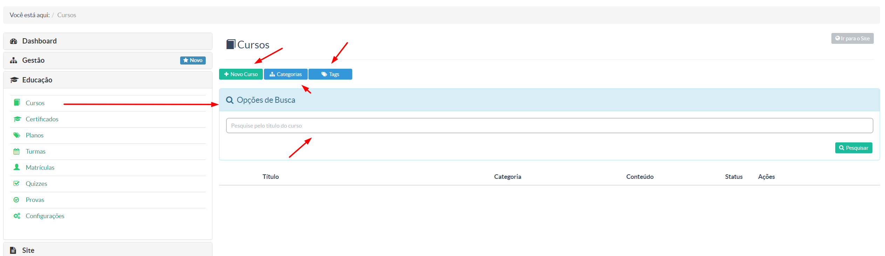
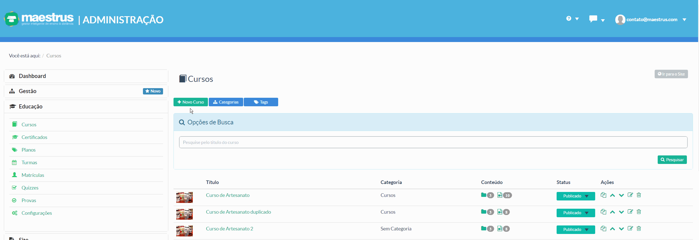

> Nessa tela o gestor terá a opção de gerenciar seus cursos, categorias e tags aplicadas nos cursos. 

As informações marcadas na imagem são: 
* Novo Curso
* Categorias
* Tags
* Campo de busca de cursos (para fazer uma busca/rápida através de termos que compõem o título do curso que deseja encontrar) 

## Criando Curso

Para criar seus cursos você deve acessar o menu **"Cursos"** e posteriormente **"Novo Curso"**

Após isso você verá uma tela composta por algumas abas que farão a configuração/composição de seu curso a ser criado, conforme a imagem abaixo:

Para fins de configuração do curso a ser criado, veja esse vídeo tutorial que ilustra e explicada detalhadamente o paao-a-passo de como criar um curso em nossa plataforma Maestrus:

Para gestão de **Categorias** e **Tags**, veja o seguinte vídeo:

