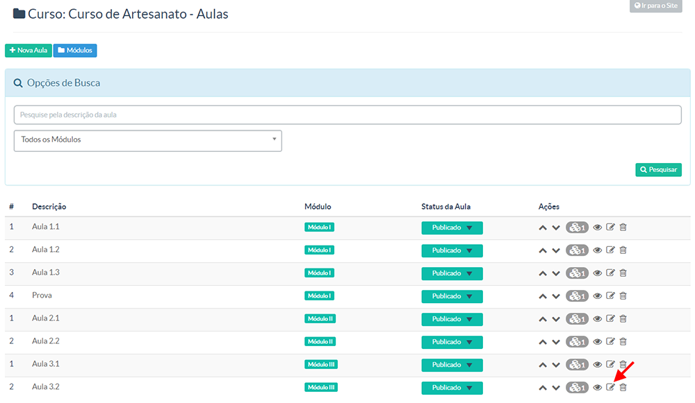

> Nessa tela, você terá a possibilidade de criar e gereciar os certificados que seus alunos receberão ao final de seus cursos.

Vá em Educação > Certificados e clique em + Novo Modelo.

1.  **Descrição do certificado** – coloque o nome do certificado;
2.  **Inserir texto padrão** – botão que insere um texto padrão (com algumas variáveis) na área Conteúdo;
3.  **Variáveis de contexto** – as variáveis disponíveis para você utilizar na área de Conteúdo;
4.  **Imagem do certificado** – fundo do certificado. Escolha entre as quatro.
5.  **Imagem customizada do certificado** – caso queira um fundo diferente das quadro oferecidas em 4), envie sua imagem. A imagem deve ser do tamanho de **29,7 cm x 21,0 cm** (tamanho padrão de uma folha A4).
Depois de feito, basta clicar em Salvar e, para visualizar como está, clique em Visualizar Modelo (ao lado do botão 2)).

Se quiser uma segunda página do certificado, geralmente uma ementa, existe a aba Segunda Página:

6. **Comportamento da 2ª Página** – Aqui temos três opções:
Nova Página em Branco – O fundo da segunda página será branco;
Mesmo fundo da primeira página – Fundo escolhido no item 4) ou 5);
Outra Imagem de Fundo – Se essa opção estiver selecionada, envie uma imagem nova pelo campo 7);
7. **Imagem da 2ª Página** – Só será utilizada se a opção Outra Imagem de Fundo (acima citada) estiver selecionada;
Feito isso, temos que configurar o texto que irá entrar na 2ª página.

### Inserindo Texto na 2ª Página ###

**Breve explicação:** Optamos por colocar o texto da 2ª Página dentro da configuração do curso, pois poderiamos ter assim, um único certificado com a primeira página com dados vindos de variáveis. E cada curso com sua grade/ementa/texto na 2ª Página.

Vá no Educação > Cursos. Clique em Editar Dados do Curso do curso que quer associar o certificado criado:

Na aba **Certificado** e em **Modelo de Certificado** escolha o certificado criado anteriormente.

8. **Modelo de Certificado** – Certificado criado anteriormente;
9. **Página adicional para certificado** – Texto que irá na 2ª página;
Até agora criamos o certificado e associamos ao curso. Agora aprenda como gerar o certificado após o aluno terminar a última aula.

### Como Gerar o Certificado na Última Aula ###

Entre na última aula desse curso:

Depois, marque a opção **Gerar certificado ao finalizar esta aula?**

Assim, quando o aluno finalizar a última aula, aparecerá a seguinte mensagem:

E ao clicar em **Gerar Certificado**, o certificado irá ser gerado e um botão amarelo irá aparecer na lateral esquerda. Se clicado, abrirá um arquivo pdf do certificado.

Deu algum problema no certificado do aluno?

Vá em **Educação** > **Matrículas**.

Encontre o aluno e o curso. Depois basta clicar em Regerar Certificado:

Feito isso teremos como resultado:

Isso evita que pessoas mal-intencionadas utilizem seu nome para dizer que tem certificado em sua EAD.