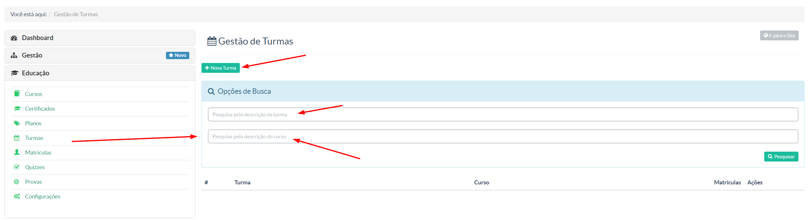
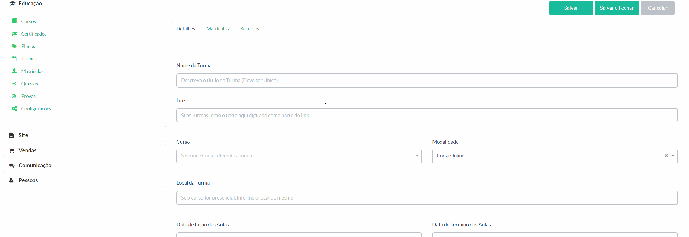

> Nessa tela, você terá a possibilidade de criar e gerenciar as turmas que comporão sua instância.

Por pesquisa, você poderá buscar por descrição da turma (uma vez já cadastrada uma turma) ou pesquisar por alguma descrição do curso cadastrado na plataforma.

Para criar uma turma, basta ir ao botão ** Nova Turma ** e você terá a tela conforme a ilustração abaixo com as seguintes abas ** "Detalhes - Matrículas - Recursos" **:

Para maiores detalhes, veja nosso vídeo tutorial a seguir:

