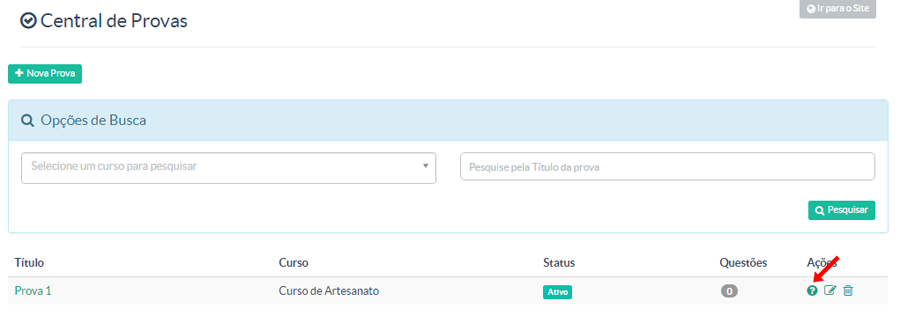

> Nessa tela o gestor terá acesso a criação e gerenciamento de provas. Diferente do módulo de  quiz, o módulo de provas é uma forma mais qualitativa de avaliação do aluno. Uma vez que sua aprovação poderá ser fator de pendência para sua evolução ao longo do curso.

As informações marcadas na imagem são

* + Nova Prova - Opção para criar uma prova
* Pesquisa por curso
* Pesquisa por título de uma prova já criada

O quadro logo abaixo dessas opção dispõem as provas já criadas e suas respectivas configurações/informações:

1. Título de prova - Nomenclatura da prova
2. Curso - Curso ao qual a prova será destinada/vinculada
3. Questões - Quantidade de questões que compõem da prova
4. Ações - Nessa parte você terá acesso as configurações da prova.
Respectivamente são: **Questões da Prova** || **Editar** || **Excluir**

Para criar uma nova prova, você deve:

Ir no botão **+ Nova Prova**

A tela a seguir é para a configuração da prova. Vale lembrar que a prova é um conjunto de exercícios.

Cada campo dessa parte deve ser preenchido corretamente para que seja alcançado pleno funcionamento de módulo.

Uma vez cadastrada uma prova, ela irá ser exibida na tela inicial de provas. Até essa parte não é configurado as perguntas. Apenas depois de criar a prova que as perguntas serão criadas.
Vá até a opção com um ponto de interrogação **"?"** para cadastrar suas perguntas.

Seguindo, para criar uma nova questão, clique no botão **+ Nova questão**:

Depois, será exibido a tela de perguntas e respostas, conforme imagem abaixo:

Você poderá inserir quantas perguntas achar conveniênte para seus cursos/alunos.

Adicione a pergunta, a descrição (se quiser) e as opções de respostas. O botão azul (no final) + Adicionar nova opção permite que você adicione mais respostas. Suponha que queira dar 5 opções de respostas. Clique nele até atingir a quantidade desejada e sete as opções para seu aluno. E na resposta certa, marque a opção Essa é a opção correta?

### Adicionando no Curso ###

Crie uma aula no curso que a prova está associada e escolha o tipo de Conteúdo Prova:

