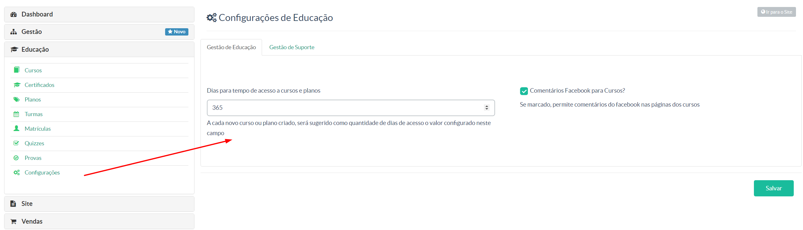

> Nessa tela o gestor poderá montar alguns padrões para melhor funcionamento da gestão de seus cursos, por conseguinte, um melhor aproveitando do seu uso da plataforma Maestrus.

Para melhor entendimento, veja nosso vídeo tutorial abaixo:

