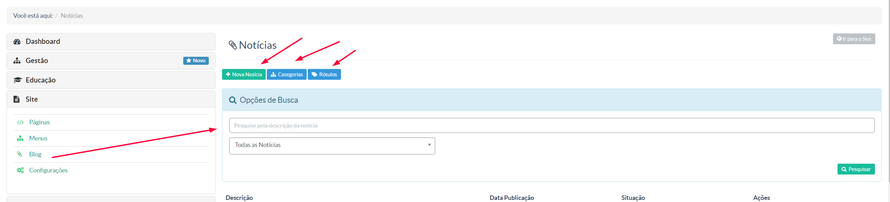
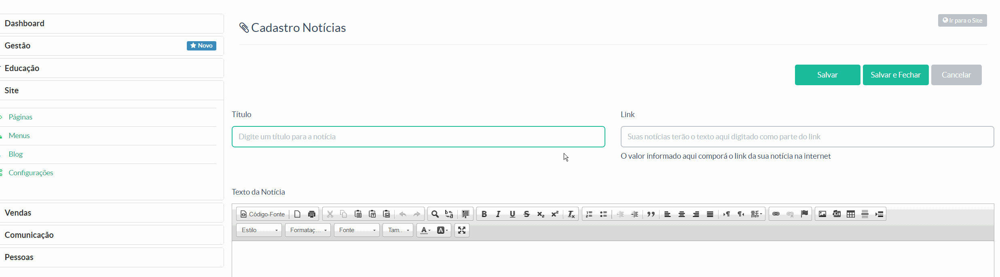
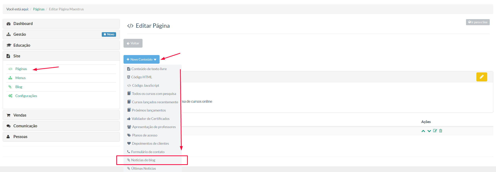

> Nessa seção, o gestor poderá dispor de nóticias para seus usuários.

Na tela acima temos as seguintes opções:

** + Notícias -** Através desse botão o gestor poderá cadastrar as notícias que serão exibidas no blog.
** Categorias -** Nessa opção, o gestor poderá cadastrar suas categorias com o propósito de organizar suas notícias. Cadastre suas categorias primeiro para sim depois cadastrar suas notícias.
** Rótulos -** Essa opção dá ao gestor a opção de cadastrar termos que facilitarão a busca dos conteúdos margados com esse termo.

Vale lembrar que, para exibir as notícias, o gestor deverá inserir como conteúdo da página que exibirá o blog **Notícias do Blog**, conforme imagem abaixo:

