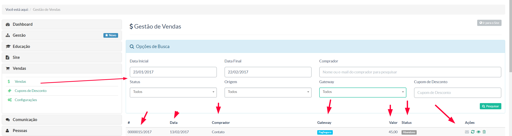

> Nessa seção, o gestor gerá todas as informações das vendas feitas em sua instância.

Na tela acima temos:

**Opções de Pesquisa -** O gestor poderá fazer inúmeros filtros para obter seus resultados pesquisados
**# -** Código da venda
**Data -** Data quando ocorreu a venda
**Comprador -** Nome do usuário/aluno cadastrado
**Gateway -** Integrador financeiro responsável pela venda (Pagseguro, Hotmart etc)
**Valor -** Preço do curso 
**Status -** Situação atual da venda. Se a compra foi efetivada (paga), se houve desistência por parte do comprador (abandono).
**Ações -** Na sequência dos ícons:
 ***Reenviar emails de acesso - Quando a compra é efetivada, enviar ao comprados seus dados de acesso***
 ***Consultar situação da venda no integrador - Atualizar o Status da venda***
 ***Ver dados da venda - Exibição detalhada das informações da venda***
 ***Excluir - Faz e exclusão da venda***
