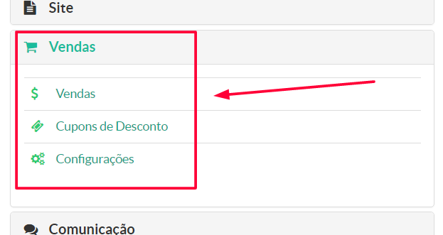
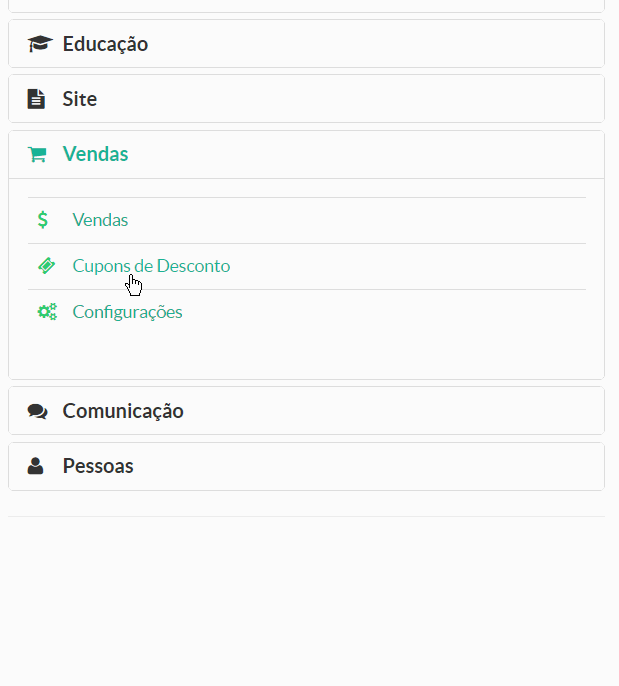

> Nesse menu, o gestor da instância na plataforma Maestrus, terá acesso a todas as informações pertinentes resultantes transações financeiras realiza em sua instância.

Vale lembrar que os módulos desse menu, variam de acordo com o plano adquirido por cada proprietário de cada instância.

