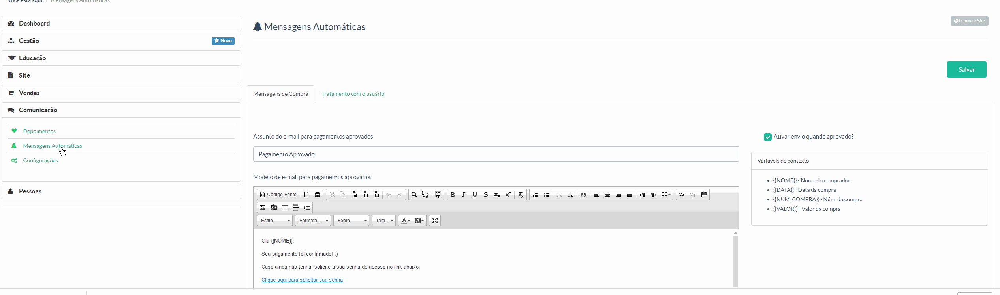

> Nessa sessão o gestor da instância poderá personalizar algumas mensagens que compõem o funcionamento da plataforma Maestrus.

Veja a imagem abaixo:

Vale lembra, que localizado ao lado do editor de texto, há uma pequena tabela contendo tag's pré definidas para ajudar a compor as mensagens.