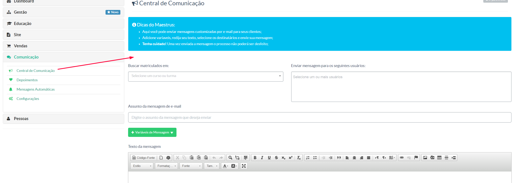

> Nessa sessão, o gestor poderá enviar enviar mensagens em lote para os usuários de determinadas matrículas efetivadas.

Na tela acima temos:

**Buscar matriculados em -** Selecionar o curso que deseja enviar a mensagem
**Enviar mensagem para os seguintes usuários -** Usuários selecionados no campo anterior. Aqui você poderá excluir algum usuário que desejar
**Assunto da mensagem de e-mail -**
**Variáveis de mensagem -** Selecionar tag's pré definidas para composição da mensagem a ser enviada
**Texto da mensagem -**