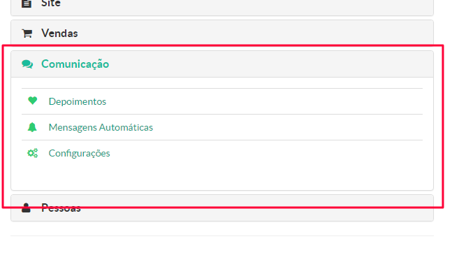
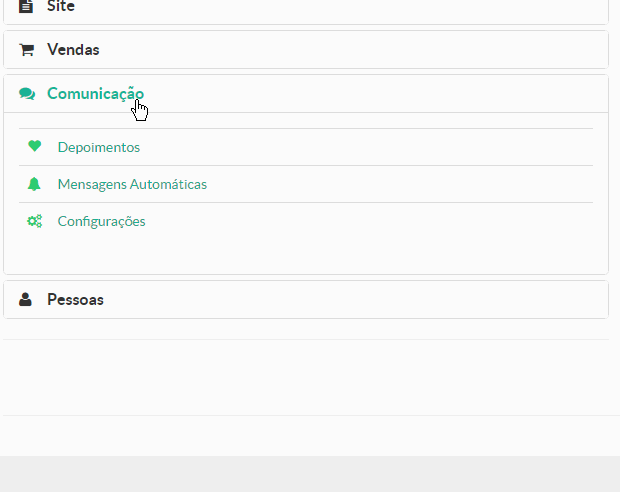

> Nesse menu, o gestor da instância na plataforma Maestrus, terá acesso a ferramentas de comunicação com os alunos cadastrados em sua plataforma.

Vale lembrar que os módulos desse menu, variam de acordo com o plano adquirido por cada proprietário de cada instância.

