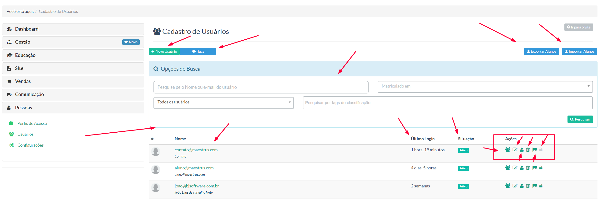
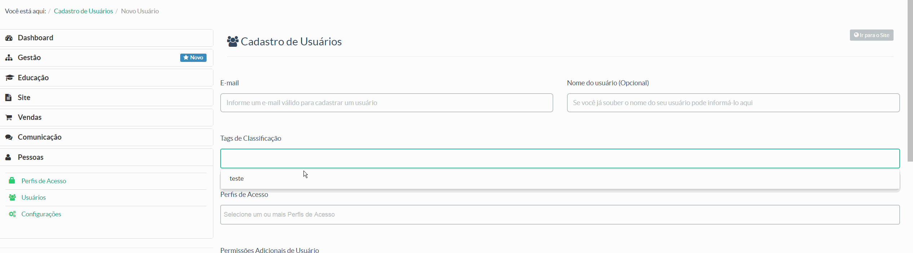

> Nessa tela o gestor terá acesso a todos os usuários cadastrados em sua instância, independente do seu perfil cadastrado.

Na tela acima tempos:

* ** + Novo Usuário -** Para cadastrar um novo usuário
* ** Tags -** Rótulos de identificação de usuário
* ** Campo de pesquisa -** Campos de pesquisa de usuários já cadastrados
* **Exportar / Importar usuários -** Através dessa opção, o gestor poderá exportar/importar usuários que desejar. Basta apenas que o gestor trabalhe com arquivos .CSV seguindo o padrao de estrutura "nome, email" para fins de registro
* **Display de usuários cadastrados -** Na sequência das colunas tempos: ***Imagem do usuário -> Nome do usuário (email) cadastrado -> Último login (registra o último acesso daquele usuário) -> Situação (ativo/inativo) -> Ações ( Simular usuário- acessar a instância como se fosse aquele determinando aluno | Editar Cadastro | Editar Perfil do Usuário ( informações pessoais) | Excluir | Inativar | Alterar Senha )

Para realizar o cadastro de um novo usuário, basta o gestor ir no botão ** + Novo Usuário** e seguir o seguinte procedimento:

