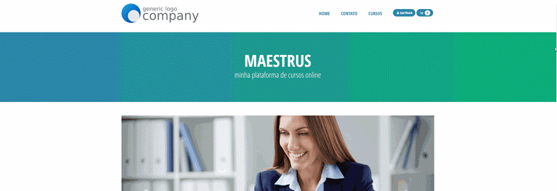
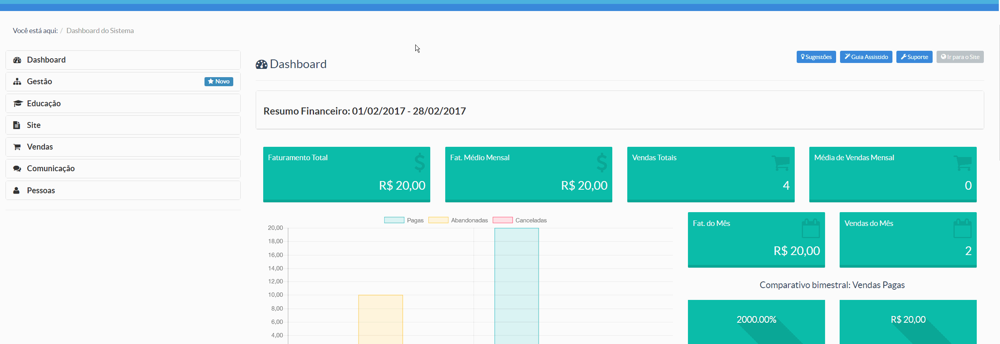
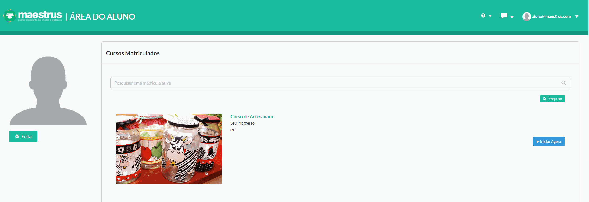

> A plataforma Maestrus possui duas interfaces gerenciáveis: 

**Frontend:** Tela de exibição de sua loja/vitrine de cursos. Onde seus usuários terão acesso aos cursos disponíveis para compra/acesso. 
Nessa tela também você poderá ter exibição de banners rotativos, depoimentos de alunos/clientes,  ícones de mídias sociais, cadastro de newsletter etc. 

**Backend:** Tela de exibição do painel de controle de sua loja/vitrine de cursos. Nesta seção fica disposta o controles como configurações de cursos, pagamentos, turmas, usuários, ou seja, configurações pertinentes ao gerenciamentos dos gestores de cursos e da plataforma. 

De mesmo modo, para o aluno, é exibido uma tela semelhante a este painel, mas com opções restritas a ele como aluno. Distinguindo painel administrativo geral e painel administrativo aluno

> Vale lembrar que a exibição de alguns módulos listados em nossa documentação irá varias de acordo com o plano contratado.
