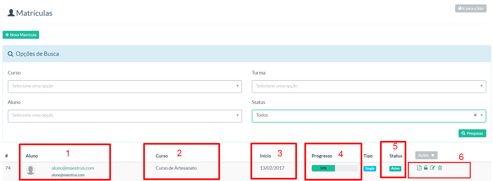

> Nessa tela o gestor terá controle de todas as matrículas realizadas em seu perfil em nossa plataforma Maestrus. 

Vale lembrar que uma vez feita a matrícula você poderá edita-la dentro desse painel. 

Obs.: Caso seja necessário, você poderá realizar matrículas manualmente por esse painel.

No campo de pesquisa de matrículas, você terá aqui a possibilidade de pesquisar por **Curso**, **Aluno**, **Turma** ou por **Status da matrícula**.

As matrículas realizadas ficarão dispostas da seguinte forma:

1. Nome/contato do aluno
2. Curso no qual o aluno esta matriculado
3. Quando inicinou o curso
4. Barra de progresso do curso
5. Status de sua matrícula
6. Configurações/edição das informações da matrícula já cadastrada. 

Respectivamente os ícones são:
 - Regerar Certificado.
 - Resetar Visualização do Curso
 - Editar dados particulares da matrícula
 - Excluir a matrícula

Para melhor entendimento, veja nosso vídeo tutorial a seguir:
