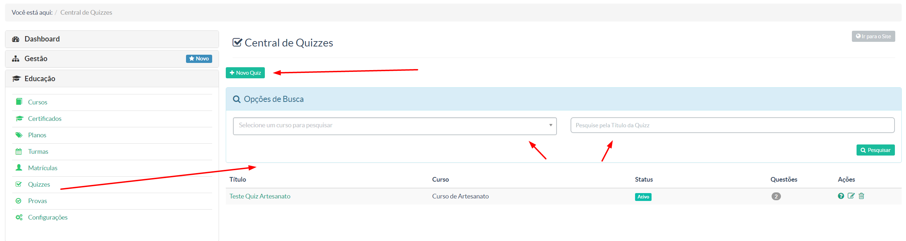
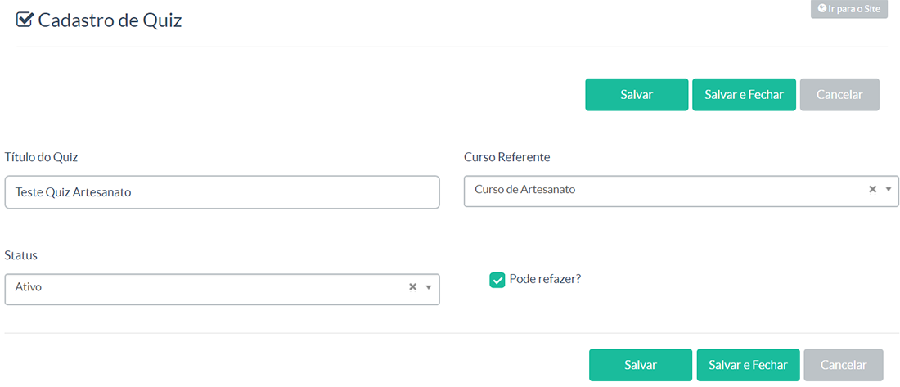
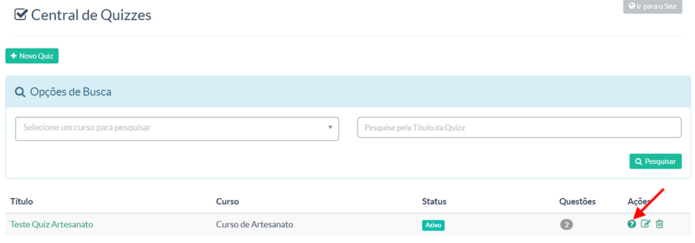
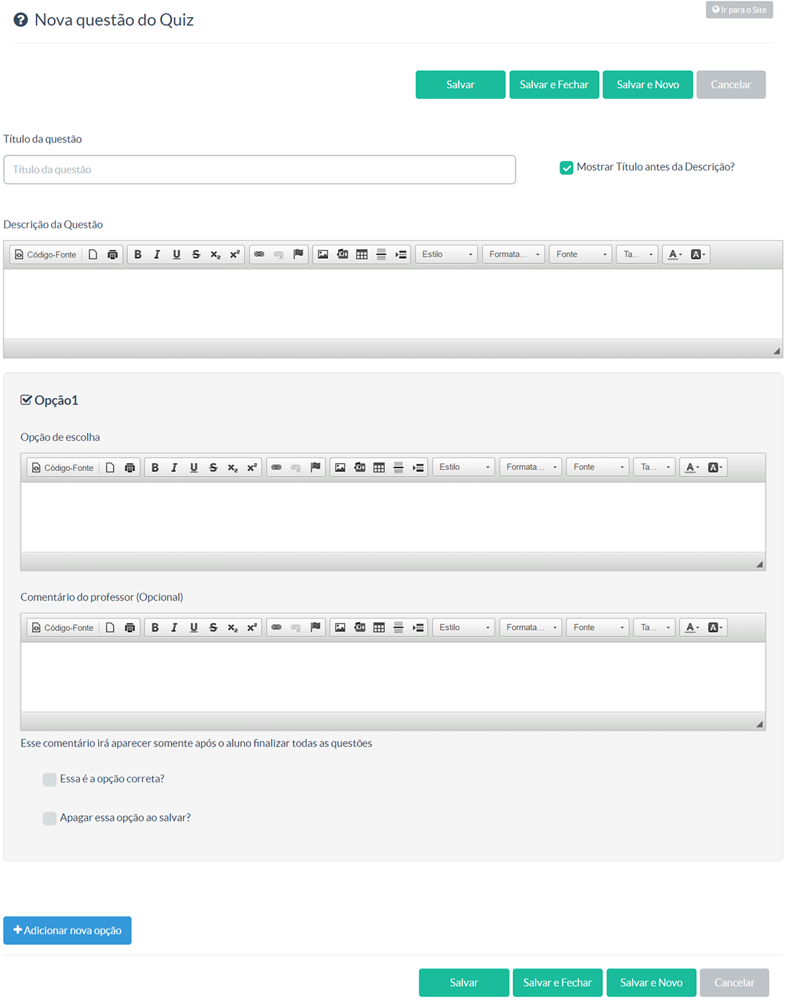
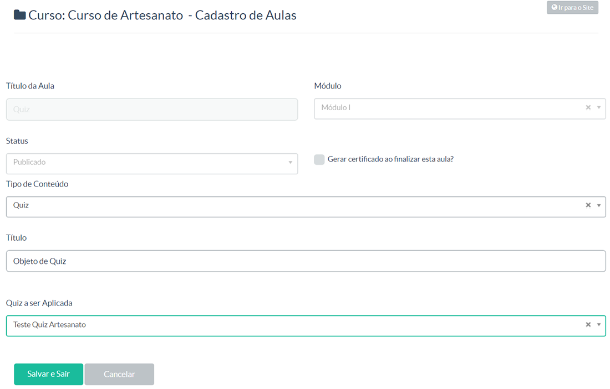

> Nessa tela o gestor terá a possibilidade de criar um quiz, composto de perguntas avaliativas para seus alunos.
 
Se você deseja criar um quiz e aplicá-lo a um curso, basta você acessar a opção **Quiz** no menu **Educação**, conforme a imagem abaixo:

Você nessa tela terá as seguintes informações: 

- Botão para criar um novo quiz.
- Pesquisa de quiz, seja pelo curso associado ou pelo próprio quiz já cadastrado (termo usado no título)
- Quiz já criado(s).

Para criar um quiz você deverá:

Ir em Educação > Quizzes

Clique em + Novo Quiz.

A tela a seguir é para a configuração do quiz. Lembrando que o quiz é um conjunto de exercícios avaliativos sobre determinado assunto.

Feito a configuração temos:

A tela acima mostra o quiz já criado. Clique no icone de interrogação para inserir as questões.

Irá para uma tela que irá listar as questões. Clique no botão + Nova Questão (canto superior esquerdo da tela).

A tela de adição da questão é bem intuitiva:

Adicione a pergunta, a descrição (se quiser) e as opções de respostas. O botão azul (no final) + Adicionar nova opção permite que você adicione mais respostas. Suponha que queira dar 5 opções de respostas. Clique nele até atingir a quantidade desejada e sete as opções para seu aluno. E na resposta certa, marque a opção Essa é a opção correta?

### Adicionando no Curso ###

Crie uma aula no curso que o quiz está associado e escolha o tipo de Conteúdo Quiz:

