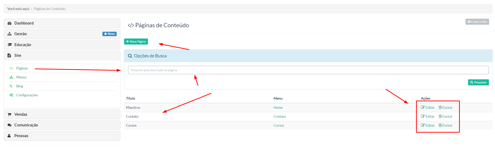
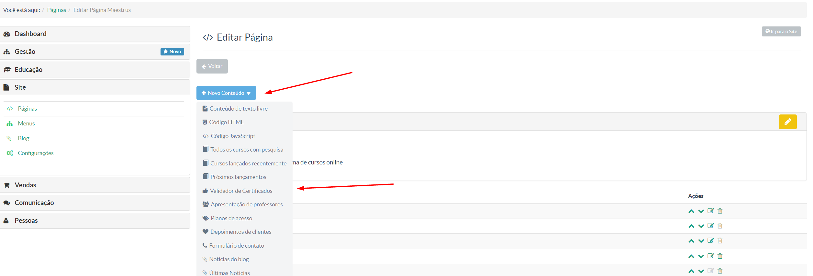

Iremos abordar nessa parte da documentação dois itens de menu, **Páginas** e **Menus**, por questões de didática funcional de ambos.

### PÁGINAS ###
> Nessa tela o gestor da instância Maestrus irá criar/editar as páginas e seus respectivos conteúdos que formaram sua página.

A imagem acima acontece quando você clica no meu **"Página** situação no menu a esquerda do seu dashboard.
Nela temos:

- ** + Nova Página -** Onde o gestor deverá clicar para criar uma nova página
- Pesquisa por descrição de uma página já criada
- **Display das páginas já criada -** Aqui, temos uma sequência: ***Nome da página -> Nome do menu -> Ações (onde poderá ser editado a página criada ou excluí-la).***

Em sequência, o gestor deverá primeira criar a página, depois, inserir o conteúdo que deseja.

Para isso basta ele ir na coluna **"Ações -> Editar"**, após isso, será exibido a seguinte tela:

Nessa tela, o gestor poderá escolher o conteúdo que deseja compor sua página, indo no menu **Novo Conteúdo** e escolher o perfil de conteúdo desejado.

Para melhor entendimento, veja nosso vídeo tutorial abaixo:

