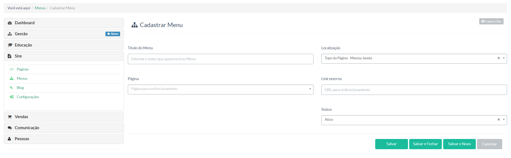

------------------------------------------------------------------------------------------------------------------------------------------------------------------------------------------------------

### MENUS ###
> Nessa tela o gestor da instância Maestrus irá criar/editar menus que formaram sua instância Maestrus.

A imagem acima acontece quando você clica no meu **"Menus** situação no menu a esquerda do seu dashboard.
Nela temos:

- ** + Novo Menu -** Onde o gestor deverá clicar para criar um novo menu
- Pesquisa por descrição de uma menu já criado
- **Display das páginas já criada -** Aqui, temos uma sequência: ***Descrição do menu já criado (nome) -> Localização (em qual posicição o menu será exibido) -> Status (ativo/inativo) -> Ações (trocar posicionamento dos menus criados, editar, e por fim, excluir)***

Ao clicar em **+ Novo Menu**, o gestor verá uma tela como a imagem abaixo:

Nessa parte deverá ser nome o menu, o posicionamento na página, para qual página ele irá apontar ou se deseja que o menu seja direcionado para um link externo.

Para melhor entendimento, veja nosso vídeo tutorial abaixo:

