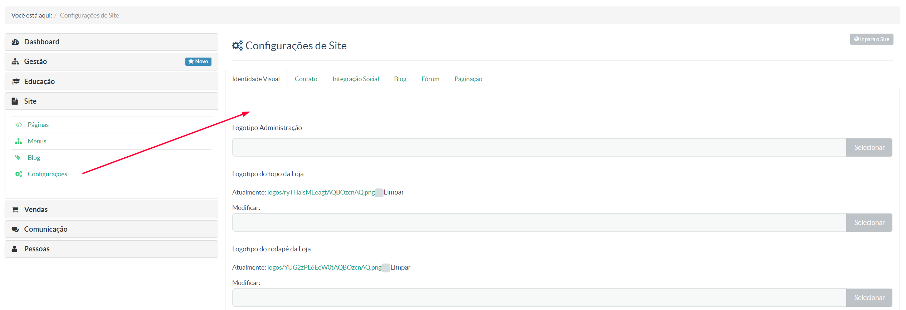

> Nessa tela, o gestor poderá configurar informações que comporão a tela inicial de sua instância

Na sequência, teremos as seguintes abas:

**Identidade Visual - ** Onde o gestor poder personalizar o frontend de sua instância de acordo com a identidade visual de sua marca ( cores, logotipo etc)
**Contato -** Aqui todas as informações que o gestor deseja para contato devem ser inseridas
**Integração Social -** Nessa aba, poderão ser integrados algumas mídias sociais a sua instância, como Facebook, Twitter, Youtube etc
**Blog -** Configuração de exibição de seu blog.
**Fórum -** Configuração de exibição do fórum de sua intância
**Paginação -** Nessa última aba o gestor poderá limitar a quantidade de páginas de seu projeto

Para melhor compreesão, veja nosso vídeo tutorial:

