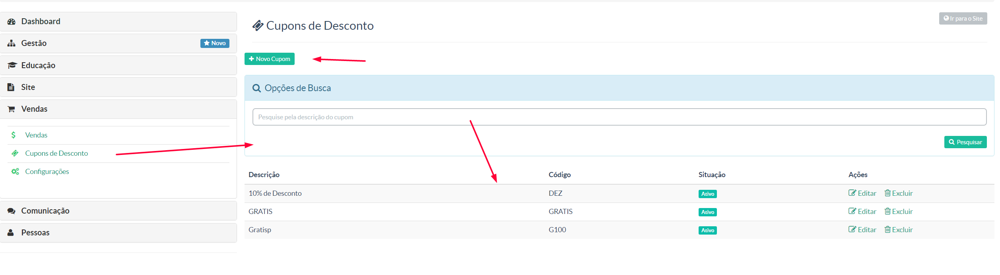
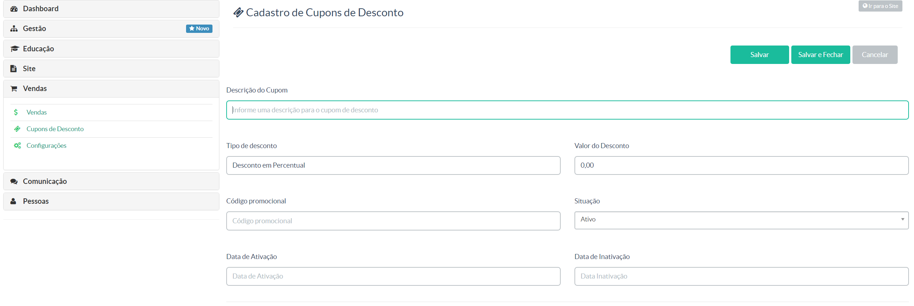

> Nessa opção, o gestor poderá criar cupons de desconto para ofertar a seus alunos e/ou futuros assinantes.

Na tela acima tempos:

**+ Novo Cupom -** Ação de criar um novo cupom de desconto
**Opção de pesquisa -** Pesquisa de cupons já cadastrados
**Display de Cupons -** Nessa área será exibido os cupons criados

Ao clicar em **+ Novo Cupom**, o gestor será redirecionado para a seguinte tela:

**Descrição do Cupom:** Título do cupom
**Tipo de desconto:** Se o cupom será um valor em porcentagem (%) ou um valor fixo R$x,00
**Valor do Desconto:** Quantitativo do desconto, porcentagem ou valor fixo
**Código promocional:** O gestor poderá criar um código aleatório para cada cupom
**Situação:** Indica se o cupom esta ativo ou inativo
**Data de Ativação:** Data que o cupom estará ativo
**Data de Inativação:** Data que o cupom limite de uso do cupom