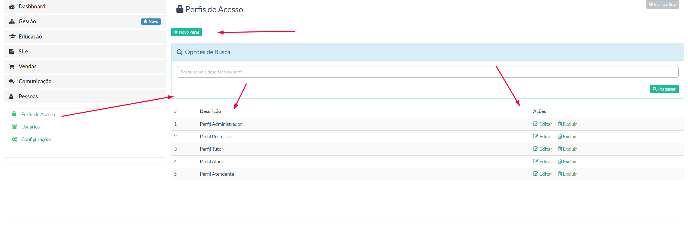
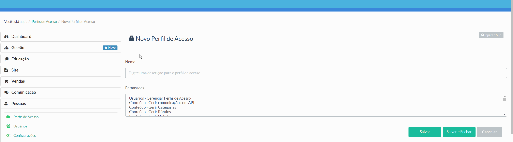

> Nessa tela o gestor poderá cadastrar os perfis de acesso pertinentes a sua instância.

Na tela acima temos:

* ** + Novo Perfil -** Área para cadastrar novo perfil
* ** Campo de pesquisa -** Onde poderá pesquisar perfis já cadastrados
* ** Display de perfis cadastrados -** Na sequência temos: ***Descrição do perfil (nome) -> Ações (editar/excluir)***

Para adicionar um novo perfil, basta o gestor ir em **+ Novo Perfil** e seguir conforme imagem abaixo:

