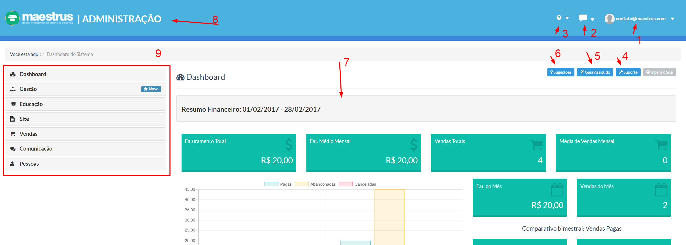
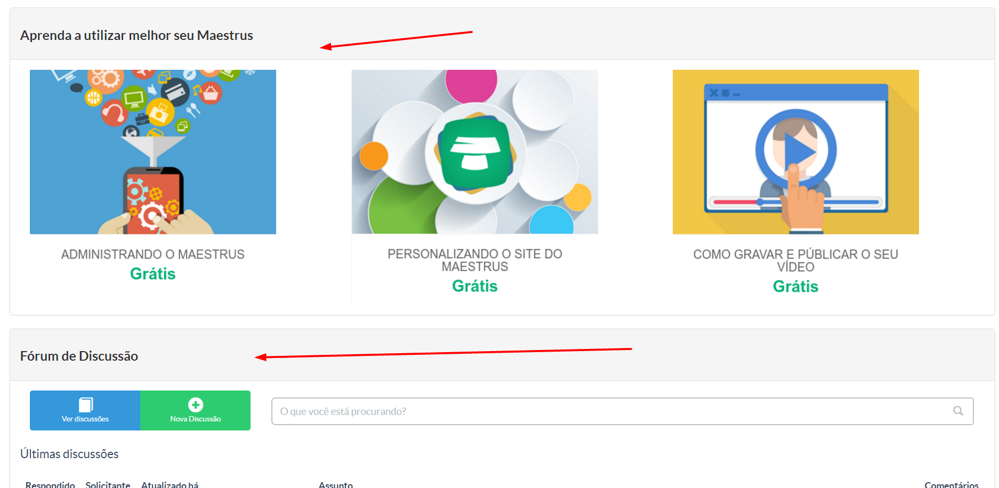

> No painel administrativo o gestor do curso terá total controle das informações e ações necessárias para administrar seu perfil de cursos dentro da plataforma Maestrus.

Vale lembrar que as opções disponíveis no painél administrativo irá variar de acordo com o  plano contratado em nossa plataforma Maestrus.

Como já visto, o aluno também terá um painel administrativo, logicamente diferente das permissões e acesso do administrador geral (gestor do curso).

Na imagem abaixo, iremos ilustrar e explicar a tela inicial do painel administrativo pela visão do gestor do curso:

**1 - Perfil ** Nessa área você terá acesso a seu perfil ( edição ), qual é o perfil adquirido em nossa plataforma e suporte para ajuda na configuração de seu perfil Maestrus.

**2 - Fórum de Discução** Nessa área você poderá criar um fórum para discução entre alunos e gestores de seu perfil Maestrus.

**3 - Central de Dúvidas** Nessa área você poderá cria uma relação de dúvidas frentes ou mesmo abrir para que alunos e gestores interajam com questões e respostas sobre os mesmos.

**4 - Suporte** Esta opção trata a mesma questão de ajuste encontrado na opção Perfil (item 1).

**5 - Guia Assistido** Esta opção exibirá um guia fazendo passa-a-passo de um funcionamento e entendimento do painel administrativo de nossa plataforma Maestrus.

**6 - Sugestões** Nessa opção você poderá inserir alguma sugestão que desejar. Dicas e segestões de melhoramento para nossa plataforma Maestrus.

**7 - Resumo Financeiro** Nesse quadro, você terá um resumo geral da movimentação financeira dentro de seu perfil Maestrus.

**8 - Identificação área do aluno / administrador geral  e empresa ** Nessa área você poderá inserir o logotipo de sua empresa, e disposto ao lado, você poderá identificar qual painel administrativo está acessando, se é a área de administração geral ou a área do aluno.

**9 - Menus gestão instância Maestrus ** Nessa área o gestor  terá acesso aos menus que controlam todos os itens da instância.

Mais a baixo, conforme a imagem a seguir, o usuário terá acesso a míni cursos gratuitos de configuração/personalização da plataforma e dicas de como gravas seus vídeos e na sequência, o gestor terá para melhor interação com seus alunos um fórum, para que se crie uma melhor interação entre professor/aluno:

